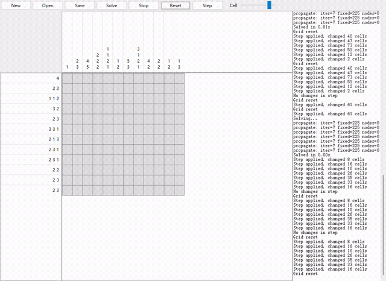

# 数织 / Nonogram / Picross 解题器（Tkinter）

本项目是一个本地桌面数织（Picross/Nonogram）解题器，使用 Python 3.10+ 与 Tkinter 构建 GUI。可编辑行列提示，进行逻辑推理与回溯搜索，并支持 JSON 保存/打开。

本项目为氛围编程产物(笑)

## 功能特性

- 行/列提示编辑与网格可视化
- 左键：未知/黑/空循环；右键：置空
- 逻辑推理（交集约束）+ DFS 回溯
- 检测无解 / 唯一解 / 多解
- Step 单步推理（只做一轮传播）
- Stop 中断求解（线程执行，UI 不会卡死）
- JSON 打开/保存当前谜题

## 运行环境

- Python 3.10+
- Tkinter（一般随 Python 安装）

## 快速开始

```bash
python main.py
```

可在界面中打开示例：`examples/sample_10x10.json`。

## 使用说明

- New：新建指定大小棋盘
- Open/Save：打开/保存 JSON
- Solve：完整求解（逻辑推理 + 回溯搜索）
- Step：单轮传播（不回溯）
- Stop：中断求解
- Reset：清空棋盘为全未知

### 输入提示

- 双击行/列提示区域进行编辑。
- 使用 `.`（小数点）分隔数字，例如 `3.1.2` 表示 3、1、2 三个块。
- 允许输入空字符串表示该行/列无黑块。
- 使用小数点是为了方便小键盘输入。
- 显示时：行提示用空格分隔，列提示竖排显示；小数点只用于输入，不会显示。

### 网格交互

- 左键：未知(-1) → 黑(1) → 空(0)
- 右键：空(0)

## 求解原理

### 逻辑推理（传播）

- 对每一行/列生成所有满足提示的线型。
- 与当前格子状态一致性过滤。
- 对所有可行线型按位求交集，得到必黑/必空。

### 回溯搜索（DFS）

- 若传播无法继续，选择候选数最少的行/列进行分支。
- 对该行/列的候选线型逐一尝试，每次尝试后继续传播。
- 找到第 2 个解即停止并报告“多解”。

### Step 与 Solve 的区别

- Step：只做一轮传播（行+列各一次），用于观察推理进度。
- Solve：重复传播直到无法推进，然后进入回溯搜索。

  

## JSON 文件格式

```json
{
  "width": 10,
  "height": 10,
  "row_clues": [[3], [1,1], [], ...],
  "col_clues": [[2], [1,1], [], ...],
  "grid": [[-1, -1, 1, 0, ...], ...]
}
```

grid 取值：
- `-1` = 未知
- `0` = 空
- `1` = 黑

## 项目结构

```
nonogram/
  __init__.py
  model.py   # 数据结构 + JSON IO
  solver.py  # 推理 + 回溯求解
  gui.py     # Tkinter UI
main.py      # 入口
README.md
README_ZH.md
examples/
  sample_10x10.json
```
